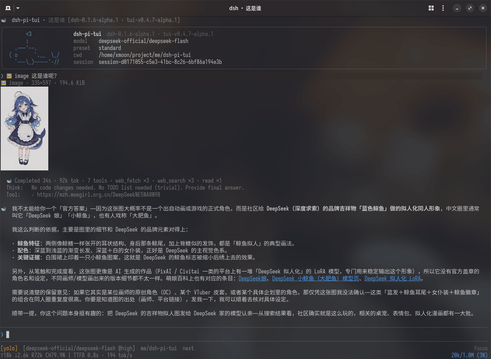

# dsh-pi-tui

[简体中文](README.md) | English

[](https://www.npmjs.com/package/@xmoon76/dsh-pi-tui)
[](LICENSE)

A Pi-style terminal frontend for [DeepSeek Harness](https://github.com/deepseek-ai/deepseek-harness).

`dsh-pi-tui` is installed as an independent dsh bundle inside a profile. It provides terminal interaction for streaming conversations, tool calls, session management, subagents, history search, shell commands, approvals, and settings. Models, tools, Sessions, permissions, Skills, Plan, Goal, and Subagent runtime behavior are still provided by DeepSeek Harness.



## Install into a DSH profile

### Stable / latest

Stable releases are recommended for ordinary users. Install DSH first, then add
the TUI to the `pi-tui` profile:

```sh
npm install -g @deepseek-ai/dsh@0.1.2-rc.1
dsh plugin --profile pi-tui -- add @xmoon76/dsh-pi-tui@latest
dsh --profile pi-tui
```

### Preview / next

Preview releases contain unreleased changes. Use this channel only when you need
to try or validate a prerelease:

```sh
dsh plugin --profile pi-tui -- add @xmoon76/dsh-pi-tui@next
dsh --profile pi-tui
```

### Requirements

* DeepSeek Harness
* Node.js `^22.19.0 || >=24`

### DSH/TUI version pairing (important)

| TUI package line | Matching DSH line | Notes |
|---|---|---|
| `0.4.0` (`@latest`) | `>=0.1.2-rc.1` | Current stable; validated against the rc.1 family |
| `0.4.x-alpha` (`@next`) | `>=0.1.2-rc.1` | Subsequent prerelease; each release validates its concrete DSH family |
| `0.4.0-alpha.2` (published) | `>=0.1.2-alpha.4` | Previous 0.4 prerelease; its releases validated the alpha.4/alpha.5 family |
| `0.4.0-alpha.1` (published) | `>=0.1.2-alpha.2` | Earlier 0.4 prerelease; accepts the alpha.2/alpha.3 runtime |
| `0.3.x` (`@0.3`) | `0.1.1-rc.2` | Legacy runtime line |

Do not mix the lines: DSH 0.1.1 is outside the 0.4 peer window and the
normal incompatible-runtime boundary will fail. The startup row prints upgrade
and rollback guidance when concurrent Loader ordering allows it, but that
friendly notice is best-effort rather than a startup-order guarantee. If you
keep DSH 0.1.1, use the 0.3 TUI line; if you keep the alpha.2/alpha.3
baseline, use `@xmoon76/dsh-pi-tui@0.4.0-alpha.1`; if you keep the
alpha.4/alpha.5 baseline, use `@xmoon76/dsh-pi-tui@0.4.0-alpha.2`. The stable
installation path is documented above under “Install into a DSH profile”; if
you need to keep the legacy DSH runtime, use this compatibility recovery path:

```sh
npm install -g @deepseek-ai/dsh@0.1.1-rc.2
dsh plugin --profile pi-tui -- add @xmoon76/dsh-pi-tui@0.3
dsh --profile pi-tui
```

The current 0.4 line declares `>=0.1.2-rc.1`; each release validates
its concrete DSH family. `npm install -g` is only for installing DSH itself; to
install dsh-pi-tui into a DSH profile, you must use the `dsh plugin` command.

New agent sessions use the official roster's selected preset id. A custom DSH
preset literally named `code` is valid and remains `code` when it exists in the
current roster. Old persisted `code` defaults/session values fall back to `ptc`
only after the roster proves that no custom `code` preset exists.

### Profile management

Update the installed TUI:

```sh
dsh plugin --profile pi-tui -- update @xmoon76/dsh-pi-tui
```

List installed plugins:

```sh
dsh plugin --profile pi-tui -- list
```

Remove the plugin:

```sh
dsh plugin --profile pi-tui -- remove @xmoon76/dsh-pi-tui
```

Resume an existing Session:

```sh
dsh --profile pi-tui --session <session-id>
```

## Features

### Conversation and tools

* Streaming Markdown output
* Collapsible Thinking blocks
* Tool Call cards with running / success / failure state
* Collapsible Tool / System details
* Full-text Transcript search
* Folding for long Session history
* Context, token, model, and runtime status
* Approval and `ask_user_question` dialogs
* Plan Review
* Todo / Goal status
* Human-readable terminal window titles
* Bounded long-session windows with stable paging and live-follow position
* No duplicate ghost Tool Cards after compaction / pruning

`Ctrl+O` controls Tool and System details — and in fullscreen Focus it bulk-expands the recent Thought roots or collapses them all. `Alt+T` controls Thinking separately.

### Focus Mode

`/focus` groups the current turn's Thinking, Tool Calls, and intermediate replies into a live Thought block.

The full process can still be expanded when needed. In fullscreen Focus, Thought roots can be expanded/collapsed in bulk or opened with an individual card click, and the viewport survives switches and resizes. Disabling Focus restores the normal Transcript projection. Focus only changes presentation; it does not modify Session events.

### Sessions

Supports persisted DSH Sessions, including:

* Creating and resuming Sessions
* Session switching
* Renaming
* Forking
* Rewind
* Session lineage
* Transcript export

Use:

```text
/sessions
/fork
/rewind
```

When the Agent is idle and the editor is empty, pressing `Esc` twice quickly also opens Rewind.

Rewind creates a new Child Session from a selected historical User Turn and restores that Prompt into the editor. The original Session is left unchanged.

### Input history

`Ctrl+R` opens input history search.

Three scopes are available:

* Current session
* Current directory
* All directories

History results include the Prompt, working directory, timestamp, and Session information. Selecting an entry restores it to the editor without submitting it.

Regular `↑` / `↓` history recall is still available for recent input.

### Subagents and background tasks

`/tasks` opens the full Task Center for all background work in the current
Session; the Footer's `↓` opens the lightweight Quick Tasks view for running work.

Subagents are shown using their complete lineage, including nested descendants:

```text
main
├─ subagent A
│  └─ subagent B
└─ subagent C
```

The browser distinguishes:

* `continuable`
* `one-shot`
* running / inactive
* nested descendants
* background Jobs

The two views share the same runtime state: `A` toggles Active / All scope,
`Tab` changes type filters, `/` enters search, `S` stops the selected task after
confirmation, and `N` / `Shift+N` moves between running tasks. In Quick Tasks,
`T` or the bottom “View all” row opens the full Task Center, and `Esc` returns
one layer at a time.

Completed one-shot Subagents remain available for persisted Transcript inspection.

A direct `continuable` Child can be opened in an interactive viewer and sent follow-up messages directly (through DSH's official `subagents.prompt()` human channel — queued in order as the Child's own next turn, with user provenance). The Child has its own Transcript, Draft, and runtime state, without modifying the main Session input.

Deeper nested Subagents are read-only by default.

The official subagent model selection (the DSH `subagent-model-selection`
setting) can be toggled and its allowlist maintained in `/settings`: once
enabled, a NEW session's official `subagent` tool may pick the child
provider/model per call (bounded by the allowlist). The setting is sampled at
session composition and never rewrites the tools of an already-running
session.

### Shell

The editor supports two Shell modes:

```text
! git status
```

Runs a local command and submits its output into the current Session.

```text
!! git status
```

Runs the command locally only. Its output is not added to model context.

`!` / `!!` are editor modes rather than plain text prefixes. The prompt and completion behavior switch together with the active mode.

Shell cards show a bounded output preview by default. `Ctrl+O` expands the retained output — except in fullscreen Focus, where Ctrl+O owns the Thought roots and the shell cards keep their folded state.

### File references and images

Typing `@` opens workspace file search and completion:

```text
@src/index.ts
@"path with spaces/file.ts"
```

`/image <path>` also completes files and directories; paths with spaces, quotes, or Windows separators preserve the input dialect, and directories can be expanded further.

Resolvable relative paths are canonicalized before submission.

Clipboard images can be added with `Ctrl+V` and persisted through the DSH Attachment service.

### Models and runtime settings

The TUI uses DSH model and settings services.

Common entry points:

```text
/model
/settings
/login
/permission
/plan
/goal
/compact
/footer
/statusline
```

Model selection, Reasoning Effort, permission presets, Plan, and Goal all keep the corresponding DSH runtime semantics.

The `Icon style` option in `/settings` switches the TUI's structural icons:
`Emoji` (default, colorful), `Symbols` (compact single-cell terminal
symbols), or `Minimal` (decorative icons hidden; only status/interaction
markers remain). Switching applies immediately and persists.

Slash Commands registered by other plugins through `ctx.commands` are discovered automatically.

### Footer customization

`/footer` is the interactive Footer editor. You can combine builtin status items, change their side and order, choose a Style and Tone, edit Prefix/Suffix and Importance, and create your own Footer items.

Four item sources are supported:

- **Builtin Item** — Model, Context, Token, Tasks, Git branch, and other built-in status facts;
- **Custom Text** — a user-created static text item;
- **Custom Command Item** — a user-created dynamic command output that can be composed with other items;
- **Extension Item** — a Footer item contributed by a plugin through the Stable Extension API.

On narrow terminals, builtins with compact forms shorten before lower-importance content is dropped. Runtime compaction never rewrites the Style you saved.

A `/footer` Custom Command Item is different from `footer: command`: the former is one dynamic item that can sit next to Model, Context, and other items; the latter hands the whole Footer status surface to one user command.

For the full `/footer` workflow, Custom Text / Command items, YAML reference, security model, and troubleshooting, see:

- [Footer customization guide](docs/footer-customization.md)
- [Extension API for plugin authors](docs/extension-api.md)

`/statusline` is an alias of `/footer`.

## Common keys

| Key           | Action                                              |
| ------------- | --------------------------------------------------- |
| `Enter`       | Submit input                                        |
| `Ctrl+Enter`  | Queue the draft while the agent is busy (the opposite of Enter while busy) |
| `Shift+Enter` | Insert newline                                      |
| `Esc`         | Cancel current interaction / interrupt running work |
| `Esc Esc`     | Open Rewind while idle                              |
| `Ctrl+C`      | Keyboard exit confirmation; clears the draft first |
| `Ctrl+D`      | Keyboard exit confirmation; press it again to quit  |
| `Ctrl+S`      | Steer queued messages and the draft into the running turn |
| `Ctrl+T`      | Toggle the todo panel                               |
| `Ctrl+R`      | Search input history                                |
| `Ctrl+F`      | Search Transcript                                   |
| `Ctrl+End`    | Jump to the latest Transcript output in fullscreen  |
| `Ctrl+O`      | Expand / collapse Tool and System details; in fullscreen Focus, bulk-toggle the Thought roots |
| `Alt+T`       | Expand / collapse Thinking                          |
| `Ctrl+G`      | Edit current input in `$VISUAL`/`$EDITOR`           |
| `Ctrl+V`      | Paste image                                         |
| `Tab`         | Autocomplete slash commands and file paths          |
| `@`           | File completion                                     |
| `!`           | Enter Shell mode                                    |
| `!!`          | Enter local-only Shell mode                         |

Use `/help` inside the TUI for the current command and keybinding list. The table above shows the defaults; after customization, `/help` and `/keybindings` show the effective keys.

### Customizing keybindings

Host shortcuts are semantic actions (`app.*`) resolved through a
context-aware keymap — the UI (footer hints, `/help`, `/keybindings`)
always shows the EFFECTIVE keys, so a remap updates every hint. Configure
them in the `dsh-pi-tui` settings namespace; apply with `/keybindings
reload` (explicit — a settings edit takes effect after the reload, no
restart):

```yaml
dsh-pi-tui:
  keybindings:
    app.input.steer: ctrl+s          # one key
    app.permission.cycle: [shift+tab, ctrl+shift+p]   # several keys
    app.history.search: ctrl+r
    app.transcript.toggleThinking: false   # disable the action's keys
    leader: ctrl+x                    # M6: leader sequences
    bindings:
      app.tasks.open: <leader>t
```

- A plain printable key can never be bound to a Host action (it would
  swallow typing); a bad entry is a warning, never a startup failure
  (fail-soft).
- Any user declaration REPLACES the action's builtin default keys:
  `app.input.steer: ctrl+x` makes Ctrl+X steer and Ctrl+S stop steering;
  a leader-only `app.todo.toggle: <leader>t` makes Leader T the only
  toggle trigger (Ctrl+T stops); `['ctrl+z', '<leader>s']` keeps both
  USER triggers; `false` removes every trigger of the action. Leader
  completions that the effective editor-owned submit key would consume (for
  example, `<leader>enter`) are rejected instead of being advertised as dead
  sequences.
- `DSH_PI_TUI_SAFE_KEYBINDINGS=1` ignores all user overrides (builtin
  defaults only). The whole `/keybindings` editor is read-only while safe mode
  is active, so it cannot save a configuration that is only checked after safe
  mode is disabled.
- In the editor, untouched default bindings that are still effective are
  selectable. `Add shortcut` materializes those surviving defaults plus the new
  key; shadowed definition defaults remain reference-only, and replacing or
  removing one surviving default preserves its siblings. Once an action has a
  user declaration, that declaration still replaces the builtin set as
  described above.
- `/help` remains the key-first, read-only help surface; `/keybindings` is the
  action-first, editable Keyboard Shortcuts Editor: it groups actions by
  category, searches action IDs/descriptions/current keys/default keys, and
  marks customized, conflict, Unbound, Disabled, and fixed states. A standalone Leader key row also configures the global leader key.
- `/settings` has one `Keyboard shortcuts` launcher that opens the same editor
  and persistence controller as `/keybindings`.
- The recorder reads a real terminal key, parses it with `parseKey`, and stores
  the canonical `KeyId`; known dead, typing-swallowing, terminal-ambiguous, and
  conflicting shortcuts are rejected before saving. Ordinary recording cancels
  on `Esc`; the direct Host interrupt recorder uses a short double-press window:
  one `Esc` cancels and two `Esc` press events assign physical Escape. Key
  repeats/releases do not count, and there is no single-letter shortcut;
  physical Escape remains reserved for Host lifecycle paths.
- Conditional affordances are labeled separately in the editor (for example,
  `Down (conditional)` for the empty-editor task browser) instead of appearing
  as ordinary configured shortcuts.
- `/keybindings conflicts` lists conflicts (same key + overlapping scope + same
  priority — never silent last-write-wins); `/keybindings reload` re-reads the
  settings (fail-soft: a bad entry is diagnosed and skipped, a throwing read
  is an error notice — never a crash; the keymap keeps the last-known-good
  configuration); `/keybindings reset` clears the overrides through the
  settings service and rebuilds the running keymap immediately.
- The subagent viewer blocks PARENT actions by action id, so a remapped
  parent shortcut stays blocked inside the viewer.
- Conditional affordances are ADDITIVE: binding `app.tasks.open: ctrl+x`
  ADDS a trigger — the empty-editor `↓` task-browser affordance still
  works; only `false` removes every trigger of an action.


## Running from source

```sh
git clone https://github.com/XMoon/dsh-pi-tui
cd dsh-pi-tui

pnpm install
pnpm build
```

Install using `file:`:

```sh
dsh plugin --profile pi-tui -- add @xmoon76/dsh-pi-tui@file:$PWD
```

`file:` copies the current build output at install time. After changing source, rebuild and add the package again.

For continuous development, use `link:`:

```sh
dsh plugin --profile pi-tui-dev -- add @xmoon76/dsh-pi-tui@link:$PWD
dsh --profile pi-tui-dev
```

After that, rebuilding is enough:

```sh
pnpm build
```

The development profile continues to point at the working tree.

## DeepSeek Harness integration

`dsh-pi-tui` implements the terminal interaction layer only.

The following capabilities are provided by DeepSeek Harness:

* Agent Loop
* LLM / Provider
* Session Persistence
* Tools
* Skills
* Approval
* Permission Presets
* Plan Mode
* Goal
* Jobs
* Subagents
* Credentials
* Settings

The TUI therefore does not maintain a separate model configuration, Session format, or Agent Runtime.

It can coexist with other DSH surfaces using the same runtime data:

```sh
dsh --profile web
dsh --profile headless
dsh --profile pi-tui
```

## Extension API

In addition to being used as a TUI, `dsh-pi-tui` exposes versioned Extension APIs for other Cordis / DSH plugins that need to extend terminal interaction.

Three public entries are currently available:

| Entry                                     | Use                             | Stability |
| ----------------------------------------- | ------------------------------- | --------- |
| `@xmoon76/dsh-pi-tui/extensions`          | General extensions              | Stable    |
| `@xmoon76/dsh-pi-tui/extensions/advanced` | Deeper interaction capabilities | Advanced  |
| `@xmoon76/dsh-pi-tui/extensions/unstable` | Low-level capabilities          | Unstable  |

Extension points include:

* Header / Footer
* Input Widget
* Slash Command
* Theme
* Setting
* Autocomplete
* Keybinding
* Message Renderer
* Tool Renderer
* Overlay
* Interactive UI
* Editor Control
* Replacement Editor

Plugins depend only on public entries and do not need to import internal types such as `TuiApp` or `TuiMainScreen`.

Minimal example:

```ts
import {
  PI_TUI_EXTENSIONS_SERVICE,
  type PiTuiExtensionService,
} from '@xmoon76/dsh-pi-tui/extensions'

export const name = 'my-plugin'
export const inject = ['tuiStartup', PI_TUI_EXTENSIONS_SERVICE]

export function apply(ctx: Context): void {
  const service = ctx.get(
    PI_TUI_EXTENSIONS_SERVICE,
  ) as PiTuiExtensionService

  if (!service.api().capabilities.has('slot.chrome.header.badge')) {
    return
  }

  service.register(
    'chrome.header.badge',
    {
      id: 'my-badge',
      order: 100,
    },
    {
      text: 'my-plugin',
      tone: 'info',
    },
  )
}
```

Documentation:

* [Extension API](docs/extension-api.md)
* [Extension tiers](docs/extension-tiers.md)
* [Advanced API](docs/extension-advanced.md)
* [Unstable API](docs/extension-unstable.md)
* [Plugin authoring](docs/plugin-authoring.md)
* [Capability matrix](docs/extension-capability-matrix.md)

## Development

```sh
pnpm install
pnpm build
pnpm typecheck
pnpm test
```

The test suite covers the Pi TUI fork, host / surface behavior, and Extension API fixtures and smoke tests.

Terminal rendering and input routing are tested extensively with `@xterm/headless`, so most UI tests do not require a real TTY or a live model connection.

Performance baseline:

```sh
node --expose-gc scripts/bench.mts
```

The project is also developed against a dedicated `pi-tui-dev` profile:

```sh
dsh plugin --profile pi-tui-dev -- add @xmoon76/dsh-pi-tui@link:$PWD
dsh --profile pi-tui-dev
```

## DSH compatibility and validation

This section contains Source Mode and CI validation details only; ordinary users do not need Source Mode to install the TUI.

### Source Mode (validation only)

Source Mode is the validation-only distribution selected by the tracked policy for `next` CI and available for local compatibility checks. It reads the full commit pin in `test/compat/dsh-source.json`, builds the official DSH tarball family, installs it through temporary pnpm overrides, and removes the temporary state afterward. Do not write DSH source paths, `file:` dependencies, or workspace symlinks into a published package.

```sh
pnpm compat:dsh:source -- --dsh-dir "$HOME/project/deepseek-harness"
pnpm compat:dsh:npm
```

The published package already contains the Pi TUI fork required at runtime. No separate internal TUI package needs to be installed.

### CI validation policy

CI follows the tracked `test/compat/dsh-mode.json` policy for pushes to `next` and pull requests targeting `next`; `main` and every tag use npm Mode. Both `next` lanes use `test/compat/dsh-source.json` for the current validated DSH target; Source Mode validates the complete official DSH tarball family, TUI presets, and the old-runtime boundary, while npm Mode runs the frozen registry lane. The published `pi2dsh` ecosystem check is explicitly marked skipped for an unpublished source family. See [`docs/dsh-compatibility.md`](docs/dsh-compatibility.md) for the full workflow.

## Repository layout

The repository root is the npm package published as `@xmoon76/dsh-pi-tui`.

The Pi TUI fork lives under:

```text
packages/pi-tui/
```

It is an internal build dependency bundled with the root package and does not need to be installed separately by users.

Upstream provenance, version information, and local divergence are tracked in:

```text
packages/pi-tui/package.json
packages/pi-tui/AGENTS.md
```

Contributor-oriented repository structure and development rules are documented in [AGENTS.md](AGENTS.md).

## Documentation

| Document                                               | Content                           |
| ------------------------------------------------------ | --------------------------------- |
| [docs/README.md](docs/README.md)                       | Documentation index               |
| [docs/architecture.md](docs/architecture.md)           | Architecture and module ownership |
| [docs/input-history.md](docs/input-history.md)         | Input history                     |
| [docs/surface-decisions.md](docs/surface-decisions.md) | TUI interaction decisions         |
| [docs/concurrency.md](docs/concurrency.md)             | Session concurrency               |
| [docs/failure-model.md](docs/failure-model.md)         | Async failure / cancellation      |
| [docs/perf-baseline.md](docs/perf-baseline.md)         | Performance baseline              |
| [docs/local-development.md](docs/local-development.md) | Local development and worktree policy |
| [docs/extension-api.md](docs/extension-api.md)         | Extension API                     |
| [AGENTS.md](AGENTS.md)                                 | Contributor operating manual      |

## Changelog

简体中文:

[CHANGELOG.md](CHANGELOG.md)

English:

[CHANGELOG.en.md](CHANGELOG.en.md)

## License

[MIT](LICENSE)
